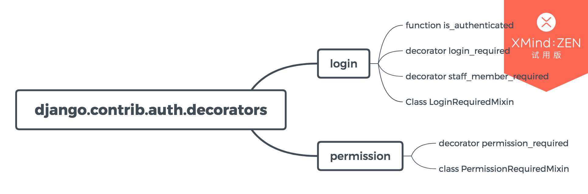

## 登录和权限

### 判断用户登录

限制未登录用户访问限制的3中方法：

##### is_authenticated

使用 request.user.is_authenticated 方法

~~~ python
from django.conf import settings
from django.shortcuts import redirect, render

def my_view1(request):
    if not request.user.is_authenticated:
        return redirect('%s?next=%s' % (settings.LOGIN_URL, request.path))
    # ...

def my_view2(request):
    if not request.user.is_authenticated:
        return render(request, 'myapp/login_error.html')
    # ...

~~~

> * view1 未认证重定向到登录页面
> * view2 显示错误信息

#### login_required(redirect_field_name ='next'，login_url = None)
使用login_required装饰器

~~~ python
from django.contrib.auth.decorators import login_required

@login_required
def my_view1(request):

@login_required(login_url='/accounts/login/')
def my_view2(request):
    ...
    
@login_required(redirect_field_name='my_redirect_field')
def my_view3(request):
    ...

~~~

> * 如果用户登录，则正常访问视图
> * 如果用户未登录，重定向到settings.LOGIN_URL，并传递当前绝对路径保存再next参数中(例如: my_view1)
> * 如果提供可选参数 login_url, 则重定向到login_url.
> * 默认情况下，默认情况下，用户再次认证成功后访问的路径存储在"next"参数中，如果你需要使用不同的名称，则使用可选参数redirect_field_name(例如my_view3), 如果自定义了参数redirect_field_name, 还需要修改登录模版。将默认"next"修改为redirect_field_name

#### staff_member_required(redirect_field_name ='next'，login_url ='admin：login')

用来对管理员身份的认证
~~~ python
from django.contrib.admin.views.decorators import staff_member_required

@staff_member_required
def my_view(request):
    ...
~~~
> * 如果用户登录， 是职员(User.is_staff=True), 并且处于活动状态(User.is_active=True), 则正常执行视图
> * 否则 请求被重定向到login_url

#### LoginRequiredMixin

继承 Class LoginRequiredMixin

~~~ python
from django.contrib.auth.mixins import LoginRequiredMixin

class MyView(LoginRequiredMixin, View):
    login_url = '/login/'
    redirect_field_name = 'redirect_to'
~~~ 

### 已登录用户的访问限制
##### if 判断， 例如对电子邮件的限制
~~~ python 
from django.shortcuts import redirect

def my_view(request):
    if not request.user.email.endswith('@example.com'):
        return redirect('/login/?next=%s' % request.path)
    # ...
~~~

##### user_passes_test(test_func，login_url = None，redirect_field_name ='next')
使用user_passe_test装饰器
~~~ python 

from django.contrib.auth.decorators import user_passes_test

def email_check(user):
    return user.email.endswith('@example.com')

@user_passes_test(email_check)
def my_view(request):
    ...
~~~

> * user_passes_test() 需要一个必需参数：一个可调用的User对象。
> * user_passes_test() 需要两个可选参数：
>   * login_url
>   * redirect_field_name

##### UserPassesTestMixin

重写 test_func()类方法。

~~~ python
from django.contrib.auth.mixins import UserPassesTestMixin

class MyView(UserPassesTestMixin, View):

    def test_func(self):
        return self.request.user.email.endswith('@example.com')
~~~

##### permission_required(perm，login_url = None，raise_exception = False)
使用装饰

~~~ python
from django.contrib.auth.decorators import login_required，permission_required

@login_required
@permission_required('polls.can_vote')
def my_view(request):
    ...
~~~

##### PermissionRequiredMixin
类继承

~~~ python 
from django.contrib.auth.mixins import PermissionRequiredMixin

class MyView(PermissionRequiredMixin, View):
    permission_required = 'polls.can_vote'
    # Or multiple of permissions:
    permission_required = ('polls.can_open', 'polls.can_edit')
~~~