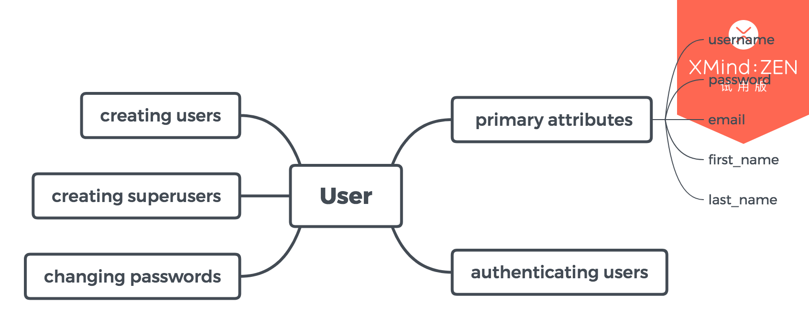

## User objects

### 主要属性

##### username

##### password

##### email

##### first_name

##### last_name

### 创建用户

##### create_user()

~~~ python

>>> from django.contrib.auth.models import User
>>> user = User.objects.create_user('john', 'lennon@thebeatles.com', 'johnpassword')

# At this point, user is a User object that has already been saved
# to the database. You can continue to change its attributes
# if you want to change other fields.
>>> user.last_name = 'Lennon'
>>> user.save()

~~~

### 创建超级用户

~~~ shell

$ python manage.py createsuperuser --username=joe --email=joe@example.com

~~~

> 根据系统提示输入需要的其他信息

### 修改密码

##### command line

~~~ shell 
$ python manage.py changepassword *username* 
~~~

##### set_password()

~~~ python

>>> from django.contrib.auth.models import User
>>> u = User.objects.get(username='john')
>>> u.set_password('new password')
>>> u.save()

~~~

### 用户验证

##### authenticate(request=None, **credentials)

~~~ python

from django.contrib.auth import authenticate
user = authenticate(username='john', password='secret')
if user is not None:
    # A backend authenticated the credentials
else:
    # No backend authenticated the credentials

~~~
