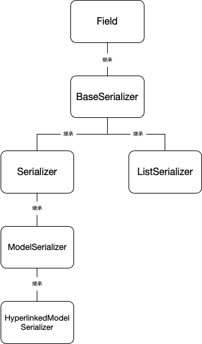

# DRF(django rest framework) 入门到入坑
[TOC]

> [官方入门教程](url "https://www.django-rest-framework.org/tutorial/1-serialization/")
> 本文档主要对官方文档做一些简单的梳理

## Serializers

> * Serializers 可以将复杂的数据类型(querysets, Model instances)转化成native Python datatypes(原生python数据类型？)然后可以轻松转换成Json,Xml等其他数据类型. Serializers 也可以反序列化,对传入数据第一次验证收,将解析的数据转换成复杂的数据类型.
> * DRF的serializer和Django的Form,ModelForm类运作非常相似.
> * Serializer类 提供了强大通用的方法来控制你的响应输出
> * ModelSerializer类 提供了模型实例和查询集创建序列化程序的快捷方式.
> [官方文档](url "https://www.django-rest-framework.org/api-guide/serializers/")

### 继承关系图

### Field 

### BaseSerializer  

    serializer 基类,继承于 Field
    BaseSerializer类是编写自定义序列化器实现可以使用的最小类

    if a `data=` argument is passed then:

    .is_valid() - Available.
    .initial_data - Available.
    .validated_data - Only available after calling `is_valid()`
    .errors - Only available after calling `is_valid()`
    .data - Only available after calling `is_valid()`

    If a `data=` argument is not passed then:

    .is_valid() - Not available.
    .initial_data - Not available.
    .validated_data - Not available.
    .errors - Not available.
    .data - Available.
<!-- 
常用方法:

* def many_init(cls, *args: Any, **kwargs: Any) -> BaseSerializer: ...
    > 当 many=True 使用, 创建一个 ListSerializer
* def create(self, validated_data: Any) -> Any: ...
    > 反向序列化时 创建对象
* def update(self, instance: Model, validated_data: Any) -> Any: ...
    > 反向序列化时 更新对象
* def save(self, **kwargs: Any) -> Any: ...
    > 反向序列化时 对象保存更改
* def is_valid(self, raise_exception: bool = ...) -> bool: ...
    > 反向序列化时 判断数据是否通过验证
* def validated_data(self) -> Any: ...
    > 验证后的数据 -->
### Serializer

    提供了 对象序列化的通用方法

<!-- 常用方法:

* def get_fields(self) -> Dict[str, Field]: ...
    > Returns a dictionary of {field_name: field_instance}.
* def validate(self, attrs): -> attrs
    > 验证数据 -->

### ListSerializer

    提供了一次序列化和验证多个对象的行为,通常不需要直接使用,可以通过many=True来简单使用

* many=True 实例化一个带有many=True的serializer时,ListSerializer实例将被创建, 序列化程序类将变成ListSerializer的子类
* allow_empty 默认是True, 实例化serializer时传入了allow_empty=False, 禁止空列表作为有效输入

### ModelSerializer

    自动创建一个Serializer类并且字段和我们django Model字段相互对应.

#### ModelSerializer 和 Serializer 的区别：

* 根据模型自动为您生成一组字段。
* 自动为序列化器生成验证器，例如unique_together验证器。
* 默认的实现了.create() 和 .update()方法

### HyperlinkedModelSerializer

> HyperlinkedModelSerializer和ModelSerializer 非常相似, 除了使用超链接代表了关系而不是主键

    序列化程序将包含url字段而不是主键字段。
    url字段将使用HyperlinkedIdentityField序列化程序字段表示，并且模型上的任何关系将使用HyperlinkedRelatedField序列化程序字段表示。

    
