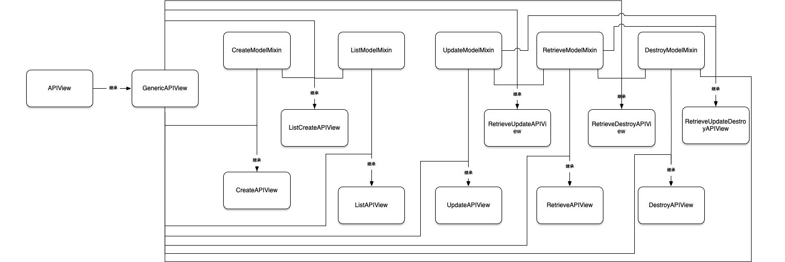

## Views

[TOC]

### 继承关系图

### APIView

> DRF提供的APIView 是Django View的子类，是所有DRF其他视图的基类，使用APIView几乎和使用Django的View一样

###### APIView 与django View的差别

* 传递给处理程序的请求是DRF的Request实例，而不是django的HttpRequest 
* 同样返回的是DRF的Response,来替换django的HttpResponse，该视图将管理内容协商并在响应上设置正确的渲染器。
* 任意的APIException将被捕获并给出相应的响应
* 将对传入的请求进行身份验证，并在将请求分派给处理程序方法之前运行适当的权限和throttle(函数节流)限制检查。

### [mixins](./view-mixins.md)
> 混合类，作用比较简单

###### CreateModelMixin   
    创建一个model实例
###### ListModelMixin 
    List a queryset   
###### RetrieveModelMixin
    Retrieve a model instance
###### UpdateModelMixin
    Update a model instance
###### DestroyModelMixin
    Destroy a model instance
    
### Generic views

> 允许您快速构建与数据库模型紧密映射的API view, 如果通用视图不适合您的API的需要，你可以使用常规APIView类,或重用mixin和基类使用的通用视图来组成自己的组可重用通用视图

###### GenericAPIView
    Base class for all other generic views
###### CreateAPIView
    Concrete view for creating a model instance
###### ListAPIView
    Concrete view for listing a queryset
###### RetrieveAPIView
    Concrete view for retrieving a model instance
###### DestroyAPIView
    Concrete view for deleting a model instance
###### UpdateAPIView
    Concrete view for updating a model instance
###### ListCreateAPIView
    Concrete view for listing a queryset or creating a model instance.
###### RetrieveUpdateAPIView
    Concrete view for retrieving, updating a model instance
###### RetrieveDestroyAPIView
    Concrete view for retrieving or deleting a model instance
###### RetrieveUpdateDestroyAPIView
    Concrete view for retrieving, updating or deleting a model instance

### View Sets

> ViewSetMixin 重写了.as_view()方法，使其可以接收'action'参数并绑定到相应的HTTP方法实现对资源的操作, 其他的View 只是继承了相应的父类，并没有增加额外的操作
###### ViewSetMixin
###### ViewSet
###### GenericViewSet
###### ReadOnlyModelViewSet
###### ModelViewSet

### decorator

###### api_view
###### API policy decorators
###### View schema decorator
<!-- ### @api_view

> @api_view(http_method_names=['GET'])

DRF框架也允许您使用基于常规函数的视图。它提供了一组简单的装饰器来包装基于函数的视图来确保他们能够收到Request,也允许他们返回一个Response,允许您配置请求的处理方式。

这个功能的核心是api_view装饰器, 需要提供一组你的函数能够处理的http 方法

### API policy decorators

> 覆盖默认设置，DRF 提供了一组额外的装饰器，可以添加到您的视图

* @renderer_classes(...)
* @parser_classes(...)
* @authentication_classes(...)
* @throttle_classes(...)
* @permission_classes(...)

    > **这些必须使用在@api_view之后**
    > 这些装饰器中的每一个都接受一个参数，该参数必须是类的列表或元组。

### View schema decorator

> 要覆盖基于函数的视图的默认schema生成,可以使用@schema装饰器
> **必须使用在@api_view之后**

    @api_view(['GET'])
    @schema(None) -->

